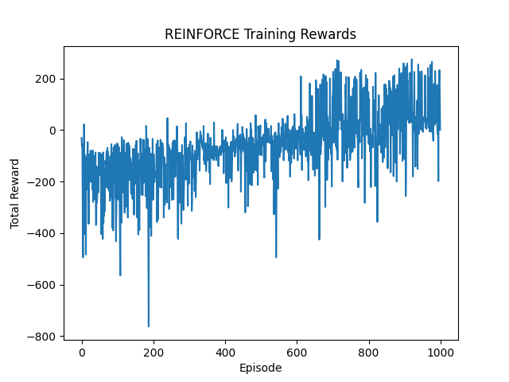
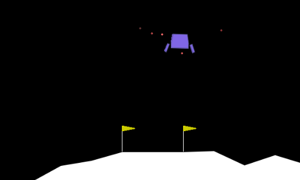

# REINFORCE Lunar Lander 🚀

This repository contains a simple yet powerful implementation of the REINFORCE algorithm for training a policy network to solve the LunarLander-v3 environment from the OpenAI Gymnasium. This project aims to provide a clean, production-ready reinforcement learning example.

---

## 📂 Directory Structure
```
REINFORCE_LunarLander/
├── README.md
├── src/
│   ├── main.py         # Main training script
│   ├── policy.py       # Policy network definition
│   └── utils.py        # Utility functions (e.g., return calculation)
├── results/
│   └── training_rewards.png  # Training reward plot
│   └── best_model.pth       # Best policy model
│   └── training_video.mp4   # Training video
└── requirements.txt    # Required packages
```

---

## ⚙️ Requirements
To set up the environment, follow these steps:

```bash
# Create a virtual environment
python3 -m venv env

# Activate the environment (Linux/Mac)
source env/bin/activate

# Activate the environment (Windows)
.\env\Scripts\activate

# Install required packages
pip install -r requirements.txt
```

---

## 🚀 Usage
To train the REINFORCE agent, follow these steps:

1. **Set up the environment** (see Requirements section above).
2. **Run the main training script:**

```bash
python src/main.py
```

This script will:
- Train the REINFORCE agent on the `LunarLander-v3` environment
- Save the best model to `results/best_model.pth`
- Generate a training reward plot at `results/training_rewards.png`
- Record a sample video at `results/training_video.mp4`

3. **Monitor training progress:**

- The training progress will be printed to the console every 10 episodes, including the total reward and the average reward over the last 10 episodes.


---

## 📊 Results
- Training rewards will be saved to **`results/training_rewards.png`**
- The best model will be saved to **`results/best_model.pth`**
- A sample training video will be saved to **`results/training_video.mp4`**

---


### 🏆 Sample Training Reward Plot
Below is a sample training reward plot generated during the training process:



---

### 🎥 Sample Training Video
Click the image below to watch the sample training video:

[](results/training_video.mp4)
